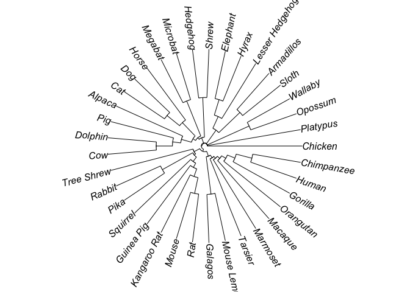

<!--
The README should be used to describe the program. It acts like the homepage of
your module.

Edit README.Rmd not README.md. The .Rmd file can be knitted to parse real-code
examples and show their output in the .md file.

To knit, use devtools::build_readme() or outsider.devtools::build()

Edit the template to describe your program: how to install, import and run;
run exemplary, small demonstrations; present key arguments; provide links and
references to the program that the module wraps.

Learn more about markdown and Rmarkdown:
https://daringfireball.net/projects/markdown/syntax
https://rmarkdown.rstudio.com/
-->

# Run [`astral`](https://github.com/smirarab/ASTRAL) with `outsider` in R

[](https://travis-ci.org/dombennett/om..astral)

> Accurate Species TRee ALgorithm: estimating an unrooted species tree
> given a set of unrooted gene trees.

<!-- Install information -->

## Install and look up help

``` r
library(outsider)
#> ----------------
#> outsider v 0.1.0
#> ----------------
#> - Security notice: be sure of which modules you install
module_install(repo = 'dombennett/om..astral')
#> -----------------------------------------------------
#> Warning: You are about to install an outsider module!
#> -----------------------------------------------------
#> Outsider modules install and run external programs
#> via Docker <https://www.docker.com>. These external
#> programs may communicate with the internet and could
#> potentially be malicious.
#> 
#> Be sure to know the module you are about to install:
#> Is it from a trusted developer? Are colleagues using
#> it? Is it supposed to download lots of data? Is it
#> well used (e.g. check number of stars on GitHub)?
#> -----------------------------------------------------
#>  Module information
#> -----------------------------------------------------
#> program: astral
#> details: Accurate Species TRee ALgorithm
#> docker: dombennett
#> github: dombennett
#> url: https://github.com/DomBennett/om..astral
#> image: dombennett/om_astral
#> container: om_astral
#> package: om..astral
#> Travis CI: Failing/Erroring
#> -----------------------------------------------------
#> Enter any key to continue or press Esc to quit
#module_help(repo = 'dombennett/om..astral')
```

<!-- Detailed examples -->

## A detailed example

``` r
# import
library(outsider)
astral <- module_import(fname = 'astral', repo = "dombennett/om..astral")

# data
# test dataset of song mammals
url <- 'https://raw.githubusercontent.com/DomBennett/om..astral/master/test_data/song_mammals.424.gene.tre'
input_file <- file.path(tempdir(), 'song_mammals.424.gene.tre')
download.file(url = url, destfile = input_file)

# run with test file and 1GB memmory
output_file <- file.path(tempdir(), 'song_mammals.tre')
astral(input_file = input_file, output_file = output_file,
       java_args = '-Xmx1000M')
#> 
#> ================== ASTRAL ===================== 
#> 
#> This is ASTRAL version 5.6.3
#> Gene trees are treated as unrooted
#> 424 trees read from song_mammals.424.gene.tre
#> All output trees will be *arbitrarily* rooted at Chicken
#> 
#> ======== Running the main analysis
#> Number of taxa: 37 (37 species)
#> Taxa: [Chicken, Marmoset, Orangutan, Human, Chimpanzee, Gorilla, Macaque, Galagos, Mouse_Lemur, Tree_Shrew, Mouse, Rat, Kangaroo_Rat, Guinea_Pig, Squirrel, Tarsier, Rabbit, Pika, Microbat, Megabat, Horse, Dolphin, Cow, Alpaca, Pig, Dog, Cat, Shrew, Hedgehog, Lesser_Hedgehog_Tenrec, Hyrax, Elephant, Sloth, Armadillos, Platypus, Opossum, Wallaby]
#> Taxon occupancy: {Rat=424, Tarsier=424, Dolphin=424, Rabbit=424, Macaque=424, Pika=424, Alpaca=424, Shrew=424, Sloth=424, Tree_Shrew=424, Kangaroo_Rat=424, Armadillos=424, Chimpanzee=424, Horse=424, Dog=424, Human=424, Lesser_Hedgehog_Tenrec=424, Microbat=424, Platypus=424, Wallaby=424, Cow=424, Pig=424, Marmoset=424, Megabat=424, Hedgehog=424, Mouse=424, Guinea_Pig=424, Mouse_Lemur=424, Cat=424, Hyrax=424, Elephant=424, Chicken=424, Orangutan=424, Opossum=424, Galagos=424, Squirrel=424, Gorilla=424}
#> Number of gene trees: 424
#> 0 trees have missing taxa
#> Calculating quartet distance matrix (for completion of X)
#> Species tree distances calculated ...
#> Building set of clusters (X) from gene trees 
#> ------------------------------
#> gradient0: 1933
#> Number of Clusters after addition by distance: 1933
#> calculating extra bipartitions to be added at level 1 ...
#> Adding to X using resolutions of greedy consensus ...
#> Limit for sigma of degrees:975
#> polytomy size limit : 4
#> discarded polytomies:  [3, 3, 4, 4]
#> Threshold 0.0:
#> Threshold 0.01:
#> Threshold 0.02:
#> Threshold 0.05:
#> Threshold 0.1:
#> Threshold 0.2:
#> polytomy of size 4; rounds with additions with at least 5 support: 0; clusters: 1933
#> Threshold 0.3333333333333333:
#> polytomy of size 3; rounds with additions with at least 5 support: 0; clusters: 1933
#> polytomy of size 3; rounds with additions with at least 5 support: 0; clusters: 1933
#> polytomy of size 4; rounds with additions with at least 5 support: 0; clusters: 1933
#> max k is :0
#> Number of Clusters after addition by greedy: 1933
#> gradient0 in heuristiic: 1933
#> partitions formed in 0.953 secs
#> Dynamic Programming starting after 0.953 secs
#> Using tree-based weight calculation.
#> Using polytree-based weight calculation.
#> Polytree max score: 28003080
#> Polytree building time: 0.238 seconds.
#> Number of quartet trees in the gene trees: 28003080
#> Size of largest cluster: 37
#> Greedy score: 24862814
#> estimationFactor: 1.1263037241078182
#> Sub-optimal score: 25489533
#> Total Number of elements weighted: 3372
#> Normalized score (portion of input quartet trees satisfied before correcting for multiple individuals): 0.9115752624354179
#> Optimization score: 25526915
#> Optimal tree inferred in 1.849 secs.
#> (Chimpanzee,(Human,(Gorilla,(Orangutan,(Macaque,(Marmoset,(Tarsier,((Galagos,Mouse_Lemur),((Tree_Shrew,((Rabbit,Pika),(Squirrel,(Guinea_Pig,(Kangaroo_Rat,(Mouse,Rat)))))),((((Chicken,Platypus),(Opossum,Wallaby)),((Sloth,Armadillos),(Lesser_Hedgehog_Tenrec,(Hyrax,Elephant)))),((Shrew,Hedgehog),((Microbat,Megabat),((Horse,(Dog,Cat)),(Alpaca,(Pig,(Dolphin,Cow))))))))))))))));
#> Final quartet score is: 25526915
#> Final normalized quartet score is: 0.9115752624354179
#> (Chicken,(Platypus,((Opossum,Wallaby)1:4.9534768802562965,(((Sloth,Armadillos)1:4.3332364705044455,(Lesser_Hedgehog_Tenrec,(Hyrax,Elephant)1:1.5072311535707152)1:3.0324267685203896)1:0.11752571582479492,(((Shrew,Hedgehog)1:1.0128082767511968,((Microbat,Megabat)1:1.5529600021930556,((Horse,(Dog,Cat)1:2.9057840368910477)0.9:0.0641150813890718,(Alpaca,(Pig,(Dolphin,Cow)1:1.3549566469016843)1:0.6392263251934307)1:3.5727535641858488)1:0.11521870556469156)1:0.43083761402314513)1:1.9714179086025256,((Tree_Shrew,((Rabbit,Pika)1:3.449399483480025,(Squirrel,(Guinea_Pig,(Kangaroo_Rat,(Mouse,Rat)1:5.045850200387328)1:0.6153942169908233)1:0.14915704136865612)1:1.6583346999346553)1:0.843253312273408)0.91:0.08610422555073367,((Galagos,Mouse_Lemur)1:2.4173938646853443,(Tarsier,(Marmoset,(Macaque,(Orangutan,(Gorilla,(Human,Chimpanzee)1:0.6434676443273446)1:2.3363022618905545)1:2.5809965452562977)1:2.687856981495734)1:4.347341076686)1:0.6511829814609134)1:2.1216694610241857)1:2.3363739622649566)1:1.5631449093243042)1:3.3544501191225256)1:0.9262330413691204));
#> Weight calculation took 0.470036888 secs
#> ASTRAL finished in 2.473 secs

# plot tree
pkgs <- installed.packages()
if (!'ape' %in% pkgs) {
  install.packages('ape')
}
tree <- ape::read.tree(file = output_file)
ape::plot.phylo(tree, type = 'fan', no.margin = TRUE)
#> Warning in ape::plot.phylo(tree, type = "fan", no.margin = TRUE): 37 branch
#> length(s) NA(s): branch lengths ignored in the plot
```

<!-- -->

<!-- Remove module after running above example -->

### Key arguments

There are three arguments for calling `astral` through R:

  - `input_file`: List of Newick gene trees, equivalent to `-i` in
    command-line version
  - `output_file`: Newick species tree, equivalent to `-o` in
    command-line version
  - `log_file`: Output log.

Additionally, there are separate Java arguments, e.g. `-Xmx` to specify
maximum memory usage.

## Links

Find out more by visiting the [ASTRAL’s
homepage](https://github.com/smirarab/ASTRAL)

## Please cite

  - Zhang, Chao, Maryam Rabiee, Erfan Sayyari, and Siavash Mirarab.
    2018. “ASTRAL-III: Polynomial Time Species Tree Reconstruction from
    Partially Resolved Gene Trees.” BMC Bioinformatics 19 (S6): 153.
    <doi:10.1186/s12859-018-2129-y>.
  - Rabiee, Maryam, Erfan Sayyari, and Siavash Mirarab. 2019.
    “Multi-Allele Species Reconstruction Using ASTRAL.” Molecular
    Phylogenetics and Evolution 130 (January). 286–96.
    <doi:10.1016/j.ympev.2018.10.033>.
  - Sayyari, Erfan, and Siavash Mirarab. 2016. “Fast Coalescent-Based
    Computation of Local Branch Support from Quartet Frequencies.”
    Molecular Biology and Evolution 33 (7): 1654–68.
    <doi:10.1093/molbev/msw079>
  - Sayyari, Erfan, and Siavash Mirarab. 2018. “Testing for Polytomies
    in Phylogenetic Species Trees Using Quartet Frequencies.” Genes 9
    (3): 132. <doi:10.3390/genes9030132>.
  - Bennett et al. (2020). outsider: Install and run programs, outside
    of R, inside of R. *Journal of Open Source Software*, In
review

## <!-- Footer -->


**An `outsider` module**

Learn more at [outsider
website](https://docs.ropensci.org/outsider/). Want to build your
own module? Check out [`outsider.devtools`
website](https://docs.ropensci.org/outsider.devtools/).
